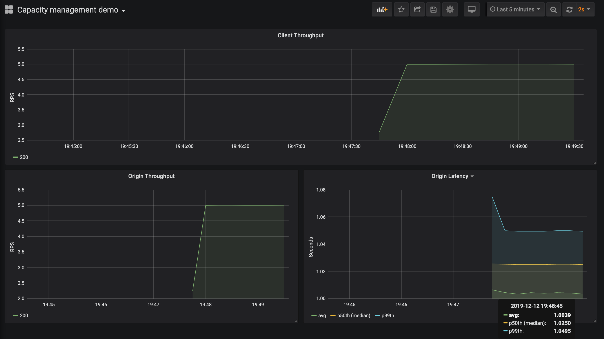
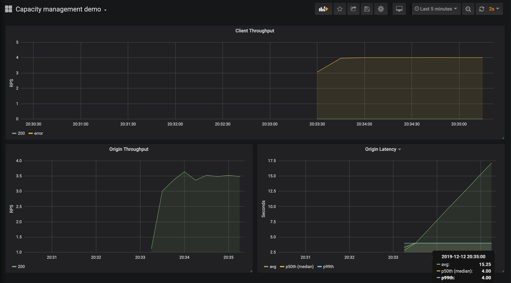
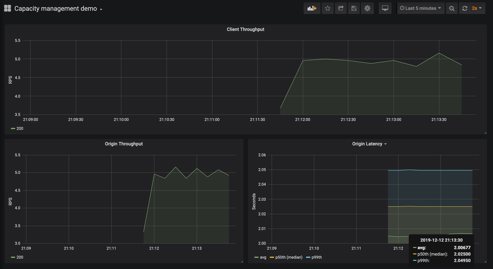
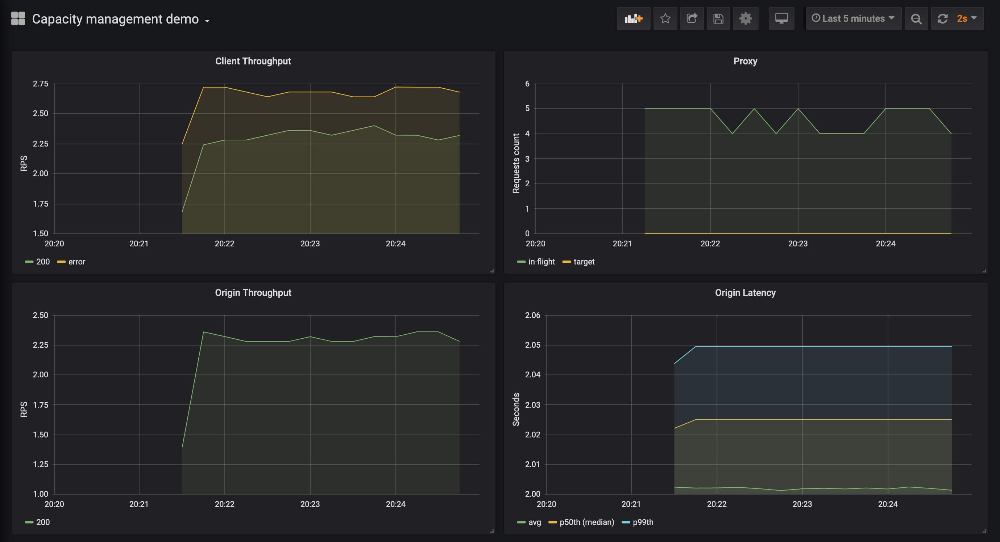
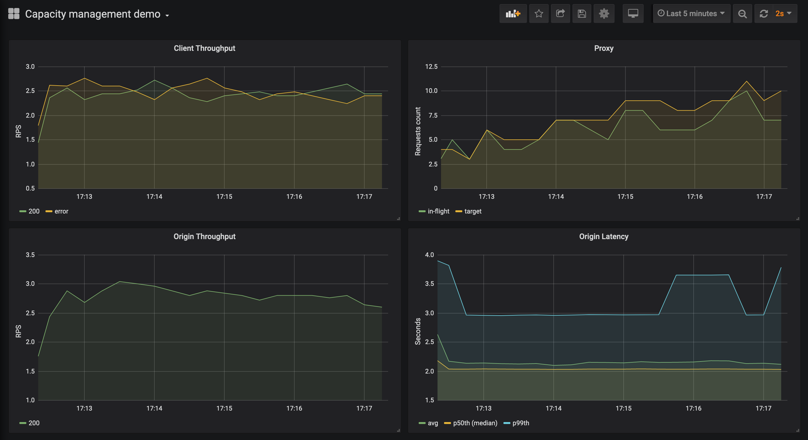

# Capacity management

Table of contents:

- [Get started](#get-started)
- [Experiments](#experiments)
  - [Slower processing, service is down](#slower-processing-service-is-down)
  - [Slower processing, service is up](#slower-processing-service-is-up)
  - [Fixed in-flight requests quota](#fixed-in-flight-requests-quota)
  - [Adaptive in-flight requests quota](#adaptive-in-flight-requests-quota)

> The most common mechanism available in both open source and commercial API gateways is rate limiting:
> making sure a particular client sends no more than a certain number of requests per unit time.
> As it turns out, this is exactly the wrong abstraction for multiple reasons.

This small project aims to reproduce results from Jon Moore's talk
[Stop Rate Limiting! Capacity Management Done Right](https://www.youtube.com/watch?v=m64SWl9bfvk).
He illustrated where rate limiting can break down using
[Little's law](https://en.wikipedia.org/wiki/Little%27s_law) `N = X * R`:

- N is capacity (number of workers)
- X is throughput (requests arrival rate)
- R is service time (how long it takes a worker to process a request)

In the examples client sends 5 requests per second using 10 workers
which wait for a response no longer than 2.5 seconds.

```sh
$ ./client -worker=10 -rps=5 -origin=http://origin:8000
```

Origin server has an SLO to serve 99% of requests within 1 second.
It has fixed number of workers, each takes 1 second on average to process a request.
Requests are enqueued when workers are busy and discarded when the queue is full.

```sh
$ ./origin -worker=7 -worktime=1s -queue=100
```

According to Little's law, origin should be able to handle 7 requests per second.

```
N = X * R
7 workers = X rps * 1s
X = 7/1 = 7 rps
```

[Run the programs](#get-started) in Docker Compose and check out Grafana dashboard:

- client sends 5 requests per second and receives HTTP 200 OK responses
- origin processes 5 requests per second
- origin has served requests with average latency 1 second
- origin has served 50% of requests (50th percentile) within 1 second
- origin has served 99% of requests (99th percentile) within 1 second

Note, [quantiles are estimated](https://prometheus.io/docs/practices/histograms/#errors-of-quantile-estimation).
Almost all observations fall into the bucket `{le="1.05"}`, i.e. the bucket from 1s to 1.05s.
The histogram implementation guarantees that the true 99th percentile is somewhere between 1s and 1.05s.
The calculated quantile might give an impression that API is close to breaching the SLO
if bucket boundaries were not chosen appropriately (sharp spikes).



## Get started

Clone the repository.

```sh
$ git clone https://github.com/marselester/capacity.git
$ cd ./capacity/docker
```

Run origin server, client (load generator), Grafana, and Prometheus using Docker Compose.

```sh
$ docker-machine start
$ eval "$(docker-machine env)"
$ docker-compose up
$ docker-machine ip
192.168.99.100
```

Open Grafana http://192.168.99.100:3000 with default credentials admin/admin.
Prometheus dashboard is available at http://192.168.99.100:9090.

Clean up once you've done experimenting.

```sh
$ docker-compose down
$ docker rmi marselester/capacity
$ docker image prune --filter label=stage=intermediate
$ docker-machine stop
```

## Experiments

### Slower processing, service is down

New release of origin server has a bug that made workers process a request within 2 seconds.

```sh
$ ORIGIN_WORKTIME=2s docker-compose up
```

According to Little's law, origin should be able to handle 3.5 requests per second.

```
N = X * R
7 workers = X rps * 2s
X = 7/2 = 3.5 rps
```

Since worker pool is able to process 3.5 requests per second, it can drain the queue at the same rate.
Requests arrive at 5 rps, which means queue will be growing infinitely.
Therefore processing time will also be growing infinitely.

```
N = X * R
∞ = 3.5 rps * R
R = ∞ / 3.5 = ∞ seconds
```

Observations:

- client sends 5 requests per second and they all time out
- origin processes 3.5 requests per second
- origin's average latency grows with queue
- origin's 50th and 99th percentiles show maximum configured latency of 4 seconds (the biggest bucket)



### Slower processing, service is up

Developers increased number of origin workers to 20 while they investigate
why a worker takes 2 seconds to process a request instead of 1 second.

```sh
$ ORIGIN_WORKER=20 ORIGIN_WORKTIME=2s docker-compose up
```

According to Little's law, origin should be able to handle 10 requests per second.

```
N = X * R
20 workers = X rps * 2s
X = 20/2 = 10 rps
```

Observations:

- client sends 5 requests per second and receives HTTP 200 OK responses
- origin processes 5 requests per second
- origin has served requests with average latency 2 seconds
- origin has served 50% of requests (50th percentile) within 2 seconds
- origin has served 99% of requests (99th percentile) within 2 seconds



### Fixed in-flight requests quota

Client should be able to send X=5 requests per second with average response time R=1 second.
This means a client should be limited to N=5 concurrent requests on a proxy.

```
N = X * R
N = 5 rps * 1s = 5 requests in flight
```

When processing time increases to R=2 seconds, a client is still limited to 5 requests in flight by proxy.
Therefore a client will end up limited to X=2.5 rps.

```
N = X * R
5 requests in flight = X rps * 2s
X = 5/2 = 2.5 rps
```

In order to allow a service to recover, a client is forced to back-off: send 2.5 rps instead of 5 rps.
Proxy limits concurrency (how many requests are in flight), not request rate (rps).

```sh
$ ORIGIN_WORKTIME=2s CLIENT_ORIGIN=http://proxy:7000 docker-compose up
```

Observations:

- client sends 5 requests per second and receives 2.3 rps (HTTP 200)
- proxy oscillates between 4 and 5 in-flight requests
- origin processes 2.3 requests per second
- origin has served requests with average latency 2 seconds
- origin has served 50% of requests (50th percentile) within 2 seconds
- origin has served 99% of requests (99th percentile) within 2 seconds



### Adaptive in-flight requests quota

If origin's capacity is unknown, it's possible to estimate capacity using
[AIMD algorithm](https://en.wikipedia.org/wiki/Additive_increase/multiplicative_decrease)
(additive-increase/multiplicative-decrease):

- increase target concurrency by a constant `c` per unit time, e.g., allow 1 more rps every second
- set target concurrency to a fraction `p` of its current size (0 <= p <= 1), e.g.,
  back-off to 75% when a service is overloaded (429 or 50x status codes, connection timeout)

Client waits for 2.5 seconds before timing out (cancels request).
In order to receive HTTP 200 OK responses a request should be processed in less than 2.5 seconds.

Request is processed within 2 seconds by origin's workers (N=7).

```
N = X * R
7 workers = X rps * 2s
X = 7/2 = 3.5 rps
```

Request has only 2.5s - 2s = 0.5 second to stay in a queue, otherwise a client won't receive it due to timeout.
Expected origin's queue length is 1.75 requests.

```
N = X * R
N = 3.5 rps * 0.5s = 1.75 requests in queue
```

Expected number of concurrent requests to origin is 8.75.

```
N = X * R
N = 3.5 rps * 2.5s = 8.75 requests in flight
```


Performance of my naive proxy is inferior and results don't correspond to Jon Moore's chart (Nginx/Lua).

```sh
$ ORIGIN_WORKTIME=2s CLIENT_ORIGIN=http://proxy:7000 PROXY_ADAPTIVE=true docker-compose up
```

Observations:

- client sends 5 requests per second and receives between 2.4 rps and 2.7 rps (HTTP 200)
- proxy oscillates between 4 and 6 in-flight requests
- origin processes between 2.7 and 3 requests per second
- origin has served requests with average latency 2.2 seconds
- origin has served 50% of requests (50th percentile) within 2 seconds
- origin has served 99% of requests (99th percentile) within 3 seconds with periodic spikes


